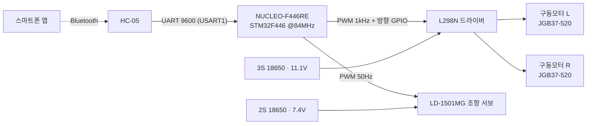

# STM32 RC Car → Mini-SDV Platform

> NUCLEO-F446RE 기반 블루투스 조종 아커만 RC카.
> 단계적으로 **엔코더 PID → 라즈베리파이(ROS2) → CAN 버스 → 다중 노드 분산 제어(미니 SDV)** 로 확장하는 것을 목표로,
> 실제 제품 개발 프로세스(요구사항 → HSI → 블록도 → 설계 → 기능/통합 테스트)를 따라 진행하는 프로젝트입니다.

## 시스템 구성

| 구분 | 사양 |
|------|------|
| MCU | STM32F446RET6 (Cortex-M4F, 84MHz 동작) — STM32CubeMX + HAL |
| 차체 | Hiwonder 아커만 스티어링 섀시 (후륜 구동 + 전륜 서보 조향) |
| 구동 | JGB37-520 12V 엔코더 기어모터 ×2, L298N, PWM 1kHz (TIM3) |
| 조향 | LD-1501MG 디지털 서보, PWM 50Hz / 500\~2500µs (TIM2), SW 안전범위 1100\~1900µs |
| 통신 | HC-05 (USART1, 9600, RX 인터럽트) · ST-Link VCP 디버그 (USART2) |
| 전원 | 듀얼팩 — 구동 3S 11.1V / 조향 2S 7.4V (Samsung 30Q 18650), 공통 GND |

## 주요 설계 결정과 근거

| 결정 | 근거 |
|------|------|
| **듀얼 배터리 (3S+2S)** | 모터는 12V 정격이라 높은 전압이 유리하지만, 서보는 6\~8.4V 제한. 팩을 분리해 각각 적정 전압을 직결 → 벅 컨버터 제거, 모터 전류 스파이크로부터 서보 전원 격리(떨림 방지) |
| **18650 고방전 셀 (30Q)** | AA 알카라인은 모터 돌입전류에서 전압 강하로 브라운아웃 위험. 30Q(15A)는 최악 피크(\~9A: 모터 2개 스톨 6.4A + 서보 스톨 3A) 대비 여유 확보 |
| **모터 PWM 1kHz / 듀티 0\~999** | L298N(BJT 기반)에 적합한 주파수. 타이머 1MHz 기반으로 듀티 분해능 0.1% |
| **서보 SW 클램프 (1100\~1900µs)** | 조향 링키지 물리 한계 보호 — 코드 레벨에서 범위 제한 |
| **UART 수신 인터럽트 방식** | 폴링 없이 1바이트 콜백 처리, 메인 루프 부하 없음 |
| **핀맵 사전 예약 (HSI)** | 엔코더(TIM4/TIM8)·I2C·초음파·라즈베리파이 UART·**CAN(PA11/12)** 까지 미리 할당 → 단계 확장 시 재배선 없음 |
| **클래식 CAN 채택 예정** | 보유 칩(F446 bxCAN) 기준 버스 통일. FOC+CAN-FD가 필요해지면 G4로 확장하되 클래식 모드로 상호운용 |

## 개발 프로세스 문서

| 문서 | 내용 |
|------|------|
| [docs/REQUIREMENTS.md](docs/REQUIREMENTS.md) | 요구사항 사양서 — 시스템 사양, 기능 요구사항(FR-01\~09), 단계 로드맵 |
| [docs/HSI.md](docs/HSI.md) | Hardware-Software Interface — 전체 핀 정의(활성/예약), 전원 넷 |
| [docs/TEST_PLAN.md](docs/TEST_PLAN.md) | 기능 테스트 계획 — 배선점검 → 전원 → 신호(PWM 파형) → 통신 → 구동 → 통합 |

## 로드맵

- [x] **P1. 기본 주행** — CubeMX 설정, 모터/서보 제어, 블루투스 명령(F/B/L/R/S + 속도) ← **현재: 펌웨어 완료, 배선·기능테스트 진행 중**
- [ ] **P2. 정밀 주행** — 엔코더(1320 cnt/rev) 속도 측정, PID 정속 제어, 초음파 장애물 정지
- [ ] **P3. 중앙 컴퓨터** — 라즈베리파이 5 + ROS2, UART 링크(cmd_vel/odom), 카메라
- [ ] **P4. CAN 버스 전환** — SN65HVD230 + 파이 CAN HAT, 미니 DBC 정의
- [ ] **P5. 미니 SDV** — 다중 MCU 노드(센서/바디), 자율주행, 웹 대시보드/OTA
- [ ] **HW Rev.B** — EasyEDA 회로도 → Nucleo 쉴드 PCB (JLCPCB)

## 빌드 환경

- STM32CubeIDE (toolchain: GCC for ARM)
- STM32CubeMX 6.17 / STM32Cube FW_F4 V1.28.3
- `rc_car.ioc`를 CubeMX로 열어 재생성 가능 (사용자 코드는 USER CODE 섹션에 유지)
